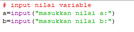
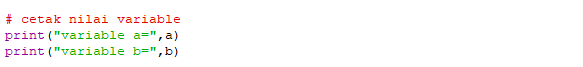
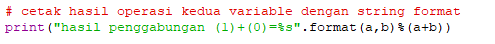
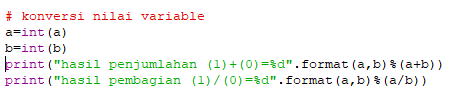
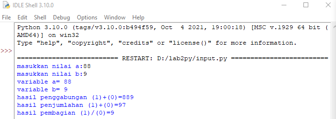

# Menggunakan fungsi input untuk mengambil nilai variable dari keyboard. 

- Input adalah masukan yang kita berikan ke program. 

- Program akan memprosesnya dan menampilkan hasil outputnya. 

- Input, proses, dan output adalah inti dari semua program komputer. 

# Pada tulisan ini, kita akan belajar cara mengambil input dan menampilkan output untuk program berbasis teks. 

# Berikut saya akan input nilai variable,seperti pada di bawah ini : 
 

# Setelah itu kita cetak atau output nilai dari variable,seperti pada di bawah ini : 

# Setelah itu kita output hasil dari kedua variable dengan string format sebagai berikut : 

# Selanjut nya kita konversikan nilai variable sebagai berikut : 

# Berikut adalah hasil dari program yang siap di jalankan : 

# Terima kasih atas waktu nya.
